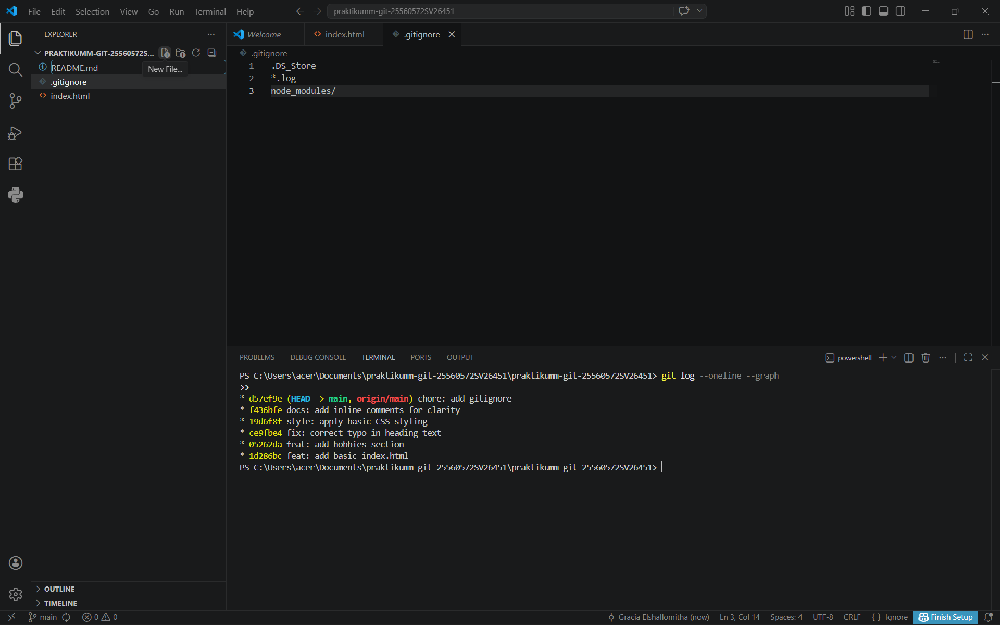
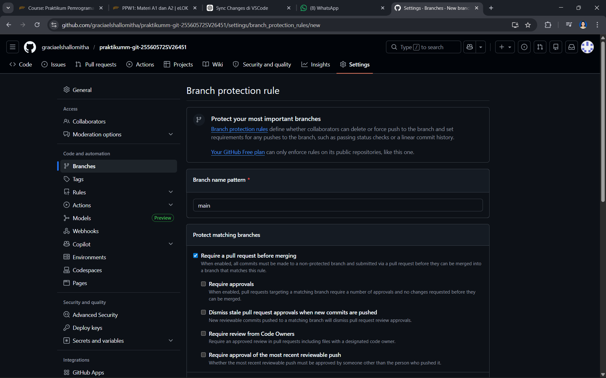
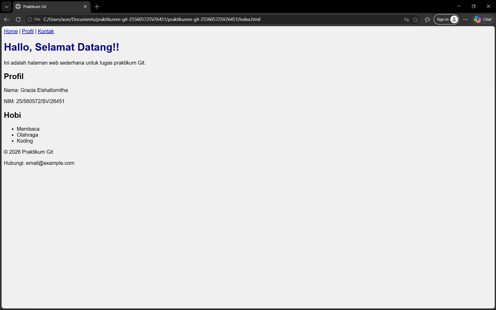

# Praktikum Git

## Commit History
Berikut screenshot hasil `git log --oneline --graph`:



## Branch Protection Rule
Berikut adalah screenshot pengaturan branch protection pada branch `main`:



## Deskripsi
Project ini dibuat untuk praktikum Git. Berisi halaman web sederhana dengan fitur dark mode, serta latihan branching, merge, rebase, dan dokumentasi alur kerja GitHub.

## Cara Menjalankan
1. Clone repository: 
   ```bash
   git clone https://github.com/username/praktikumm-git-25560572SV26451.git

2. Masuk ke folder project:
   ```bash
   cd praktikumm-git-25560572SV26451

3. Buka file index.html di browser untuk melihat tampilan website.

## Screenshot Website
Berikut screenshot hasil website: 


## Dokumentasi Perintah Git
Berikut daftar perintah Git yang digunakan selama praktikum, beserta penjelasan singkat:

git init → membuat repository baru di lokal.

git clone <url> → menyalin repository dari GitHub ke lokal.

git status → mengecek status perubahan file.

git add <file> → menambahkan file ke staging area.

git commit -m "pesan" → menyimpan perubahan dengan pesan commit.

git branch <nama-branch> → membuat cabang pengembangan baru.

git checkout <nama-branch> → berpindah ke branch tertentu.

git merge <branch> → menggabungkan branch ke branch aktif.

git push origin <branch> → mengirim commit ke GitHub.

git pull → menarik perubahan terbaru dari GitHub.

git rebase -i HEAD~3 → menggabungkan beberapa commit menjadi satu (squash).

git rebase --abort → membatalkan proses rebase yang gagal.

git rebase --continue → melanjutkan rebase setelah edit commit.

git log --oneline --graph → melihat riwayat commit dengan ringkas.

git reset --soft HEAD~3 → mengembalikan commit ke staging untuk digabung ulang.

git push origin feature/dark-mode --force → force push hasil rebase ke GitHub.

git config --global core.editor "code --wait" → mengatur VS Code sebagai editor Git.

git config --global core.editor "notepad" → alternatif editor jika VS Code bermasalah.

## Branch Protection Rule
Repository ini menggunakan Branch Protection Rule pada branch `main`:
- Require pull request sebelum merge
- Restrict direct push ke `main`